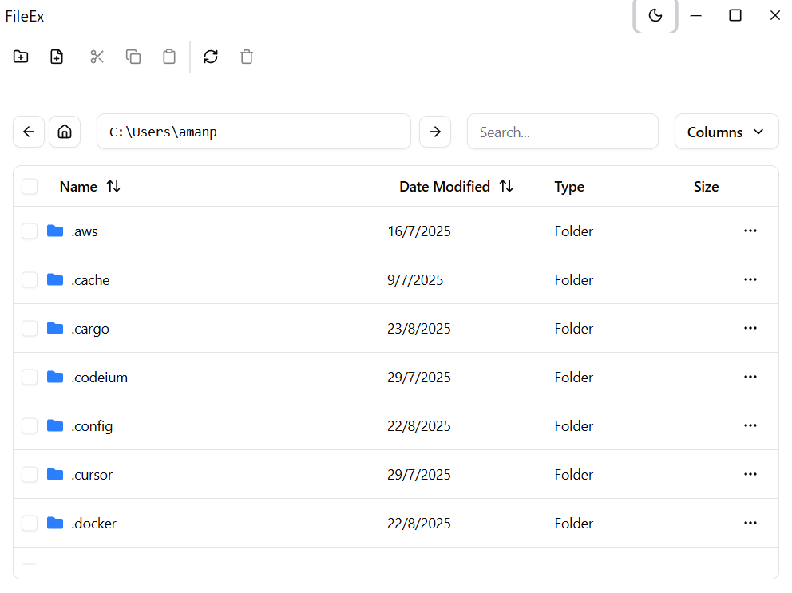
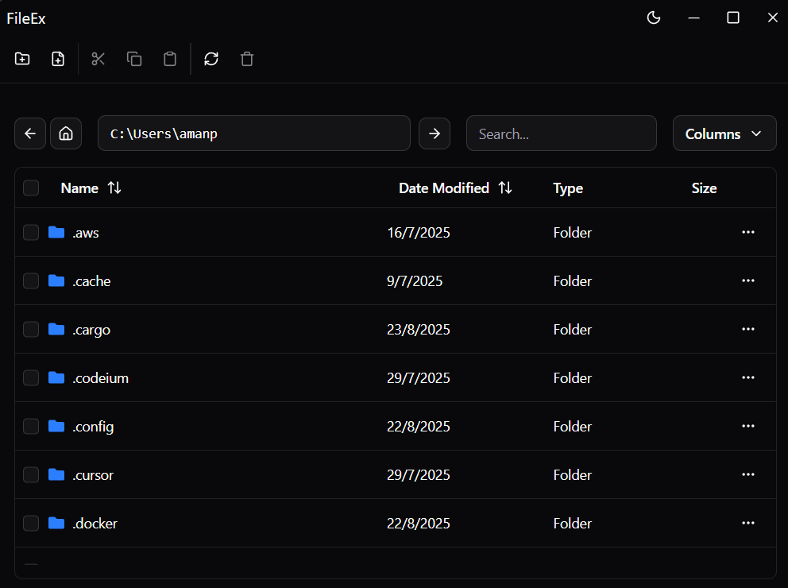

# FileEx - Modern File Explorer

A modern, feature-rich file explorer built with Tauri, React, TypeScript, and shadcn/ui. FileEx provides a clean, intuitive interface for managing files and folders with advanced features and beautiful UI components.

## 📸 Screenshots

<div align="center">
  <table>
    <tr>
      <td align="center">
        
        <br/>
        <sub><b>Light Theme</b></sub>
      </td>
      <td align="center">
        
        <br/>
        <sub><b>Dark Theme</b></sub>
      </td>
    </tr>
  </table>
</div>

---


## ✨ Features

### 🗂️ **File Management**
- **Browse Directories**: Navigate through your file system with ease
- **Create Files & Folders**: Create new files and folders with validation
- **Rename Items**: Rename files and folders inline
- **Delete Items**: Safe deletion with confirmation dialogs
- **File Icons**: Beautiful icons for different file types and folders

### 📋 **Clipboard Operations**
- **Cut & Copy**: Full clipboard support for files and folders
- **Paste**: Paste files/folders with recursive copying
- **System Clipboard**: Copy file paths to system clipboard for external use

### 🎨 **Modern UI/UX**
- **Custom Window Controls**: Minimize, maximize, and close buttons
- **Responsive Layout**: Adapts to different window sizes
- **Table View**: Sortable table with file details (name, size, type, date modified)
- **Search & Filter**: Real-time file search and filtering
- **Column Management**: Show/hide columns and resize them
- **Toast Notifications**: Beautiful, non-intrusive notifications using Sonner
- **Dialog System**: Professional dialogs for confirmations and input

### 🔧 **Advanced Features**
- **Path Navigation**: Direct path input and navigation
- **File Selection**: Multi-select files with checkboxes
- **Context Menus**: Right-click actions for individual files
- **Keyboard Shortcuts**: Quick actions with Enter/Escape keys
- **Loading States**: Visual feedback during operations
- **Error Handling**: Comprehensive error handling with user-friendly messages

### 🎯 **File Operations**
- **Double-click Navigation**: Open folders by double-clicking
- **Bulk Operations**: Perform actions on multiple selected files
- **File Type Detection**: Automatic file type detection and icons
- **Size Formatting**: Human-readable file sizes
- **Date Formatting**: Localized date display

## 🚀 Quick Start

### Prerequisites
- [Node.js](https://nodejs.org/) (v18 or higher)
- [Rust](https://rustup.rs/) (latest stable)
- [Git](https://git-scm.com/)

### Installation

1. **Clone the repository**
   ```bash
   git clone https://github.com/Amanbig/fileEx.git
   cd fileEx
   ```

2. **Install dependencies**
   ```bash
   npm install
   ```

3. **Start development server**
   ```bash
   npm run tauri dev
   ```

4. **Build for production**
   ```bash
   npm run tauri build
   ```

## 🛠️ Technology Stack

### Frontend
- **React 18**: Modern React with hooks and functional components
- **TypeScript**: Type-safe development
- **Vite**: Fast build tool and dev server
- **Tailwind CSS**: Utility-first CSS framework
- **shadcn/ui**: Beautiful, accessible UI components
- **TanStack Table**: Powerful table component with sorting, filtering
- **Lucide React**: Beautiful SVG icons
- **Sonner**: Toast notifications

### Backend
- **Tauri 2.0**: Rust-based desktop app framework
- **Rust**: Systems programming language for performance
- **Serde**: Serialization/deserialization
- **Chrono**: Date and time handling
- **Tokio**: Async runtime

### UI Components
- Button, Input, Label, Tooltip
- Dialog, ScrollArea, Separator
- Table, Checkbox, DropdownMenu
- Toast notifications (Sonner)

## 📁 Project Structure

```
fileEx/
├── src/                          # React frontend
│   ├── components/
│   │   ├── app/
│   │   │   ├── fileStructure.tsx # Main file explorer component
│   │   │   ├── commandsPallet.tsx # Toolbar with file operations
│   │   │   └── titleBar.tsx      # Custom window title bar
│   │   └── ui/                   # shadcn/ui components
│   ├── lib/
│   │   └── utils.ts             # Utility functions
│   ├── App.tsx                  # Main app component
│   └── main.tsx                 # React entry point
├── src-tauri/                   # Rust backend
│   ├── src/
│   │   ├── lib.rs              # Tauri commands and file operations
│   │   └── main.rs             # Main Rust entry point
│   ├── Cargo.toml              # Rust dependencies
│   └── tauri.conf.json         # Tauri configuration
├── public/                     # Static assets
└── package.json               # Node.js dependencies
```

## 🎮 Usage Guide

### Basic Navigation
1. **Browse Files**: The main table shows files and folders in the current directory
2. **Open Folders**: Double-click on folders to navigate into them
3. **Go Home**: Click the home button to navigate to your home directory
4. **Path Input**: Type or paste a path in the address bar and press Enter

### File Operations
1. **Create New**:
   - Click the folder+ icon to create a new folder
   - Click the file+ icon to create a new file
   - Enter the name in the dialog and click "Create"

2. **Select Files**:
   - Click checkboxes to select individual files
   - Use the header checkbox to select all files

3. **Cut/Copy/Paste**:
   - Select files and click the cut (scissors) or copy icon
   - Navigate to destination and click paste (clipboard) icon

4. **Delete Files**:
   - Select files and click the trash icon
   - Confirm deletion in the dialog

### Advanced Features
- **Search**: Use the search box to filter files by name
- **Sort**: Click column headers to sort by name, date, type, or size
- **Resize Columns**: Drag column borders to resize
- **Show/Hide Columns**: Use the "Columns" dropdown to toggle visibility

## 🔧 Configuration

### Window Settings
The app uses a custom window frame with these features:
- Transparent title bar
- Custom window controls
- Resizable and maximizable
- Minimum size: 800x600

### Tauri Commands
Available Rust commands that can be called from the frontend:
- `get_current_directory()` - Get current working directory
- `get_home_directory()` - Get user's home directory
- `list_directory(path)` - List files and folders in a directory
- `navigate_to_path(path)` - Navigate to a specific path
- `create_folder(path, name)` - Create a new folder
- `create_file(path, name)` - Create a new file
- `delete_item(path)` - Delete a file or folder
- `rename_item(old_path, new_name)` - Rename a file or folder
- `copy_items(source_paths, destination_path)` - Copy files/folders
- `move_items(source_paths, destination_path)` - Move files/folders

## 🎨 Customization

### Themes
The app uses Tailwind CSS with CSS variables for theming. You can customize colors in:
- `src/App.css` - Global styles and theme variables
- `tailwind.config.js` - Tailwind configuration

### File Icons
File type icons are defined in `fileStructure.tsx`. Add new file types by extending the `getFileIcon` function.

## 🐛 Troubleshooting

### Common Issues

1. **App won't start**
   - Ensure Rust and Node.js are installed
   - Run `npm install` to install dependencies
   - Check that ports 1420 and 1421 are available

2. **Build fails**
   - Update Rust: `rustup update`
   - Clear node modules: `rm -rf node_modules && npm install`
   - Check Tauri prerequisites: `npm run tauri info`

3. **File operations fail**
   - Check file permissions
   - Ensure paths exist and are accessible
   - Look at console logs for detailed error messages

## 📝 Development

### Recommended IDE Setup
- [VS Code](https://code.visualstudio.com/)
- [Tauri Extension](https://marketplace.visualstudio.com/items?itemName=tauri-apps.tauri-vscode)
- [rust-analyzer](https://marketplace.visualstudio.com/items?itemName=rust-lang.rust-analyzer)
- [TypeScript Hero](https://marketplace.visualstudio.com/items?itemName=rbbit.typescript-hero)

### Scripts
```bash
npm run dev          # Start frontend dev server only
npm run tauri dev    # Start full Tauri development
npm run build        # Build frontend for production
npm run tauri build  # Build complete app for production
npm run lint         # Run ESLint
```

## 🤝 Contributing

1. Fork the repository
2. Create a feature branch (`git checkout -b feature/amazing-feature`)
3. Commit your changes (`git commit -m 'Add amazing feature'`)
4. Push to the branch (`git push origin feature/amazing-feature`)
5. Open a Pull Request

## 📄 License

This project is licensed under the MIT License - see the [LICENSE](LICENSE) file for details.

## 🙏 Acknowledgments

- [Tauri](https://tauri.app/) - For the amazing desktop app framework
- [shadcn/ui](https://ui.shadcn.com/) - For the beautiful UI components
- [Lucide](https://lucide.dev/) - For the gorgeous icons
- [TanStack Table](https://tanstack.com/table) - For the powerful table component

## 📞 Support

If you have any questions or issues, please:
1. Check the [Issues](https://github.com/Amanbig/fileEx/issues) page
2. Create a new issue with detailed information
3. Join our community discussions

---

**Built with ❤️ using Tauri, React, and TypeScript**
